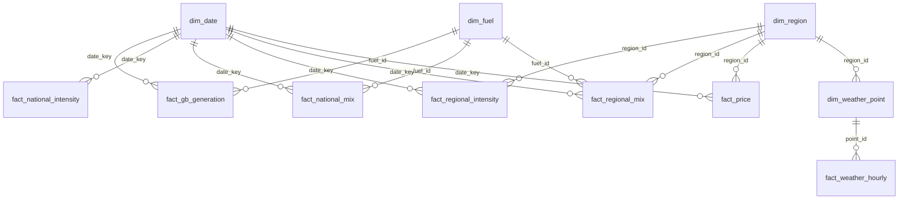

# Clean Power 2030

I built this to see whether Britain is on track for the government's target of 95% clean
electricity by 2030. It uses every half-hour of Great Britain's generation since 2009, NESO's
capacity plans set against the Clean Power 2030 target, and eight years of regional mix, Octopus
Agile prices and weather. That's over 30 million rows, refreshed every morning by an Azure
pipeline and shown in a two-page interactive dashboard.

**Live:** https://tristanbowdenfreeman-maker.github.io/tiny-summit/carbon/ (part of my
[portfolio](https://tristanbowdenfreeman-maker.github.io/tiny-summit/))

## What it finds

- About 68% of the electricity generated in Britain over the last 12 months came from clean
  sources (wind, solar, nuclear, biomass and hydro), up from 23% in 2009. The target is 95% by 2030.
- Over the last seven years the clean share has gone up by about 2 points a year. At that pace it
  reaches about 77% by 2030. Getting to 95% would take about 6 points a year.
- Coal fell from 44% of generation in 2012 to zero, while wind grew from 1% in 2009 to 35%.
- Batteries are on pace, and onshore wind and solar are close. Offshore wind is furthest behind,
  with about 16 GW built and 34 GW expected by 2030, against 43 GW needed.
- South Scotland's power is 99% clean and South West England's is 35%, with most of the rest
  from gas. Across Britain, gas made 41% of power on calm days and 16% on windy ones, and power
  cost about 11p per kWh more when it was calm. The grid is dirtiest and most expensive from 4 to
  7pm.

The site's figures update with the data, so they may have moved on from these.

## Method and caveats

- **Clean share** is electricity generated in Britain from wind, solar, hydro, biomass and
  nuclear, as a share of all electricity generated in Britain. Imports are left out of the total, as
  they are in the Clean Power 2030 target. Which fuels count as clean is set in one place, the
  `is_low_carbon` flag in `dim.fuel`.
- **Current pace** is a least-squares slope through the last seven full years, worked out in T-SQL,
  so one unusual year doesn't swing it. **Needed pace** is the straight line from the last 12
  months to 95% in mid-2030.
- **The 2030 projection is a straight line.** Real growth comes in steps as big wind farms
  connect, so the line is there to show the size of the gap and isn't a forecast.
- **It isn't the official figure.** DESNZ put 2025 at 73% using different source data and a
  slightly different set of fuels. This project measures every year the same way, so the trend is
  comparable even though the level differs.
- **Regional mixes are estimates** from the Carbon Intensity API's power-flow model. **Prices** are one
  retail tariff that tracks the wholesale market. **Weather** is one point per region.
- **Gaps in the source data** (a few hundred missing half-hours from the APIs, each under 0.5%)
  are counted by the data checks in [5_checks](sql/5_checks).

## Data model

A star schema: eight fact tables share four dimensions. The two biggest tables use clustered
columnstore indexes because the marts scan whole years at a time.



`fact.capacity` (built, planned and needed GW for four technologies) stands alone. It has 32 rows
and is keyed on technology and year.

| Table | Grain | Rows |
|---|---|---|
| `fact.regional_mix` | region × fuel × half-hour, since 2018 | ~24M |
| `fact.gb_generation` | fuel × half-hour, since 2009 | ~3M |
| `fact.regional_intensity` | region × half-hour | ~2.6M |
| `fact.price` | region × half-hour | ~2M |
| `fact.national_mix` | fuel × half-hour | ~1.3M |
| `fact.weather_hourly` | weather point × hour | ~1.1M |
| `fact.national_intensity` | half-hour | ~150K |

## How the data flows

```
NESO Data Portal     ─┐
Carbon Intensity API  │
Octopus Agile prices  ├─► Azure Function ─► stg    raw JSON, gzip, one row per source and window
Open-Meteo (ERA5)    ─┘   (Python, timer)    │     T-SQL stored procedures (OPENJSON)
                                             ▼
                          Azure SQL         dim + fact   star schema (columnstore for the big one)
                          (serverless)       │     views
                                             ▼
                                            mart ─► data checks ─► JSON ─► Blob Storage ─► website
```

1. **An Azure Function** runs at 05:30 UTC every day. It downloads any new or unsettled date
   windows and saves each one, compressed and untouched, into `stg.api_raw`.
2. **Stored procedures** parse the JSON into `dim` and `fact` tables, a window at a time, each
   in its own transaction. Re-loading a window replaces its rows, so every step is re-runnable.
3. **Views** in `mart` do the analysis, one per visual: the yearly mix since 2009, the trend
   against the pace 2030 needs ([04_v_on_track.sql](sql/4_marts/04_v_on_track.sql), a
   least-squares slope in T-SQL), capacity against target, regional clean shares, and each
   region's half-hours joined to price and wind ([08_v_region_half_hour.sql](sql/4_marts/08_v_region_half_hour.sql)).
4. **Data-quality checks** run next. A blocking failure stops the export, so the site keeps its
   last good data. Non-blocking ones (gaps in the source) are saved with the export
   (`data_checks.json`) and the export goes ahead.
5. **The export** writes each mart view to JSON in a public Blob Storage container, which the
   website reads. The site falls back to its own copy if Blob Storage can't be reached.

Why these choices: Azure SQL's serverless free offer pauses itself when idle and gives 100,000
vCore-seconds a month. It stays awake for an hour after each run, so one run a day uses about
half of that, and if the allowance ever ran out it would pause until the next month and never
charge. Keeping raw JSON in staging means a change to the model only needs a reload from staging,
without downloading seventeen years of data again.

## Where to look

**SQL** (`sql/`, run in folder and file order)

| Folder | What's in it |
|---|---|
| [0_setup](sql/0_setup) | Schemas |
| [1_staging](sql/1_staging) | The raw-JSON table and its upsert procedure |
| [2_model](sql/2_model) | `dim_date`, `dim_region`, `dim_fuel`, `dim_weather_point` and eight fact tables |
| [3_etl](sql/3_etl) | One load procedure per source; [04_usp_load_regional.sql](sql/3_etl/04_usp_load_regional.sql) is the biggest |
| [4_marts](sql/4_marts) | One view per visual; [04_v_on_track.sql](sql/4_marts/04_v_on_track.sql) is the headline, [10_v_region_wind.sql](sql/4_marts/10_v_region_wind.sql) grid to weather |
| [5_checks](sql/5_checks) | Data-quality checks, one row per check |

**Python** (`src/grid_carbon/`)

| File | What it does |
|---|---|
| [sources.py](src/grid_carbon/sources.py) | The APIs, how history is split into date windows, retries |
| [pipeline.py](src/grid_carbon/pipeline.py) | Works out which windows need fetching and stages them |
| [transform.py](src/grid_carbon/transform.py) | Runs the load procedures and the checks |
| [export.py](src/grid_carbon/export.py) | Mart views to JSON, locally and to Blob Storage |
| [db.py](src/grid_carbon/db.py) | Connects to Azure SQL and runs the `sql/` scripts |

**Azure:** [infra/deploy.sh](infra/deploy.sh) creates everything (resource group, SQL server and
free serverless database, storage account, Function App) and is safe to re-run;
[function_app/](function_app) is the timer-triggered function.

## Run it

Needs Python 3.12, the Azure CLI and an Azure subscription.

```bash
python3.12 -m venv .venv && source .venv/bin/activate
pip install -r requirements.txt && pip install -e .

az login
infra/deploy.sh                       # creates the Azure resources and writes .env
python -m grid_carbon setup-db        # schemas, tables, procedures, views
python -m grid_carbon run             # fetch, transform, check, export (first run backfills 2009 on)
infra/publish_function.sh             # deploy the daily function
python -m grid_carbon status          # rows at every stage
```

To work on the site: `python -m http.server --directory site` (it reads the last export in
`site/data`). `python tools/build_map.py <geojson>` rebuilds the region map from NESO's DNO
licence area boundaries.

## Data and licences

- Generation since 2009 ("historic generation mix"), Future Energy Scenarios capacities and the
  Clean Power 2030 capacity targets ("resource adequacy"): [NESO Data Portal](https://www.neso.energy/data-portal),
  NESO Open Data Licence.
- Regional generation mix and the live figures: [Carbon Intensity API](https://carbonintensity.org.uk),
  CC BY 4.0. Regional figures are estimates from its power-flow model.
- Prices: [Octopus Energy](https://developer.octopus.energy/) Agile tariff, public API, used here as
  a half-hourly tariff that tracks the wholesale market.
- Weather: [Open-Meteo](https://open-meteo.com) historical API (ERA5 reanalysis), CC BY 4.0. Wind
  speed at 100 m at the centre of each region, plus Dogger Bank for offshore wind.
- The government's own 2025 figure (73%) is from DESNZ, Open Government Licence v3.
